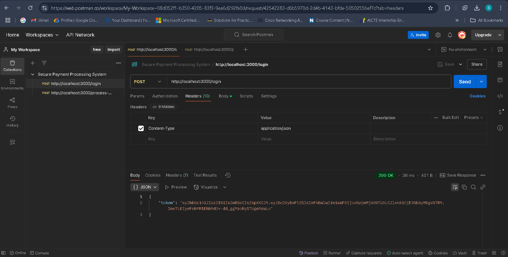
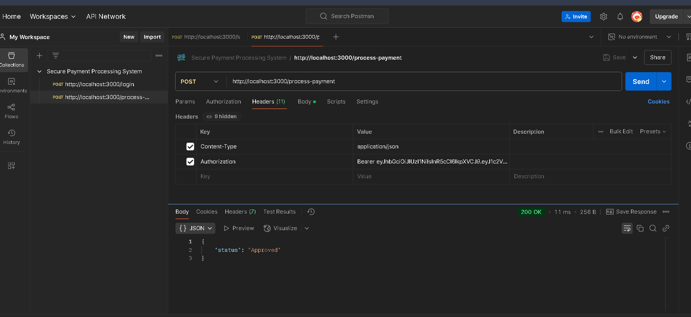
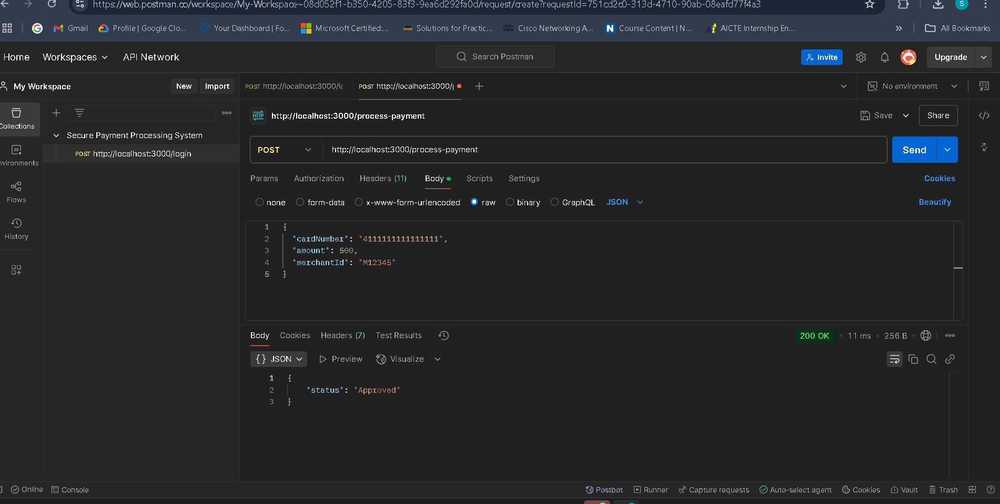
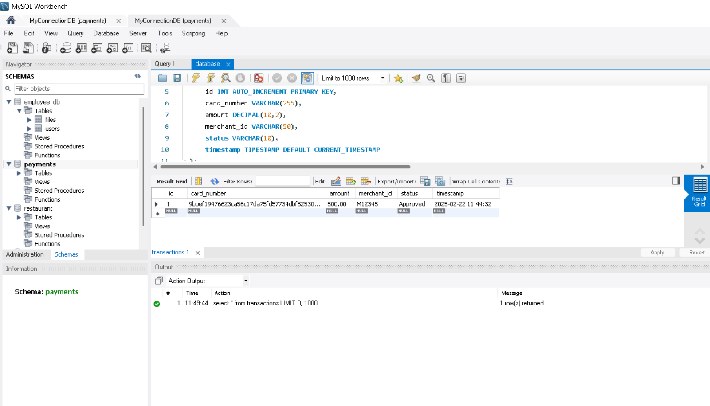

# 🚀 Secure Payment Processing System


## 📖 Project Description
The **Secure Payment Processing System** is a backend API designed to handle **secure financial transactions**.  
It allows users to **authenticate**, submit **payment requests**, and ensures **data security** through encryption.  
The system stores transactions in a **MySQL database**, providing a structured and secure way to manage payments.

## 📌 Features
✅ **User Authentication** – Login with JWT tokens  
✅ **Payment Processing** – Submit transactions for approval  
✅ **Data Security** – Encrypts card details before storing  
✅ **MySQL Database** – Stores transaction history  


## 📸 Screenshots
### 🔹 **1️⃣ API Testing in Postman**





### 🔹 **2️⃣ MySQL Transactions Table**


## 🛠️ Tech Stack
- **Backend:** Node.js, Express.js  
- **Database:** MySQL  
- **Security:** JWT, Crypto  
- **API Testing:** Postman  

## 🚀 How to Run Locally
1. **Clone the repository**  
   ```bash
   git clone https://github.com/your-username/secure-payment-processing.git
   cd secure-payment-processing
2. **Install dependencies**
   ```bash
   npm install
3. **Start MySQL & Import Database**
   ```bash
   mysql -u root -p < database.sql
4. **Run the server**
   ```bash
   node server.js
